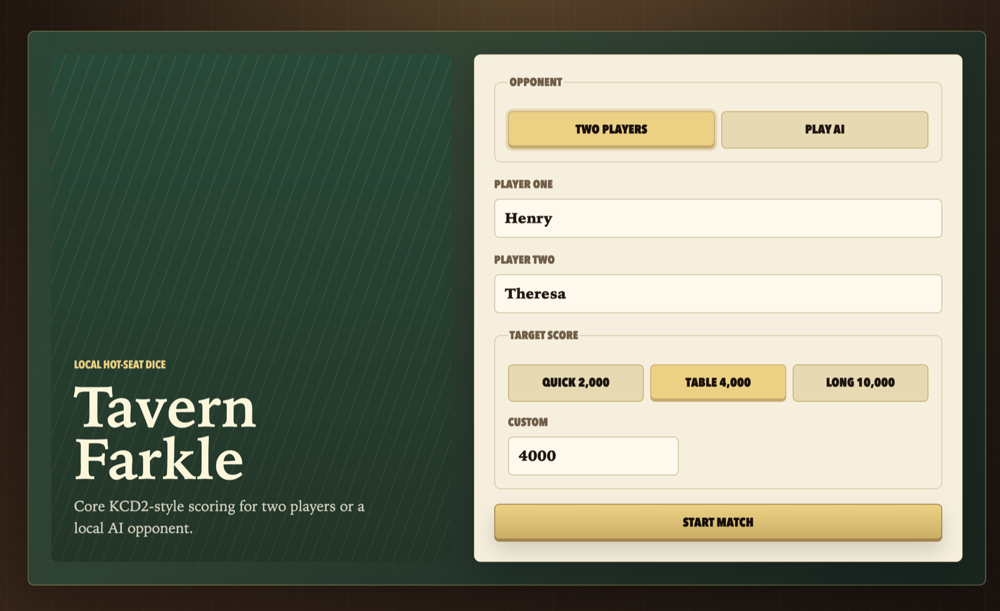
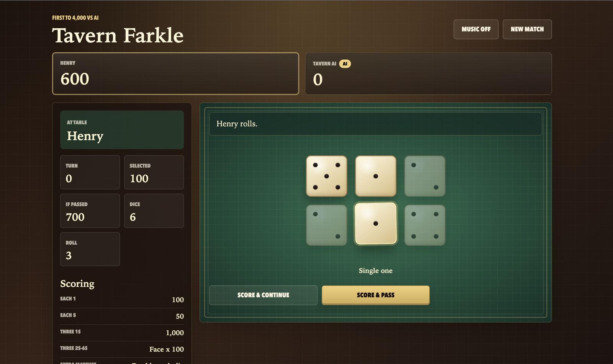
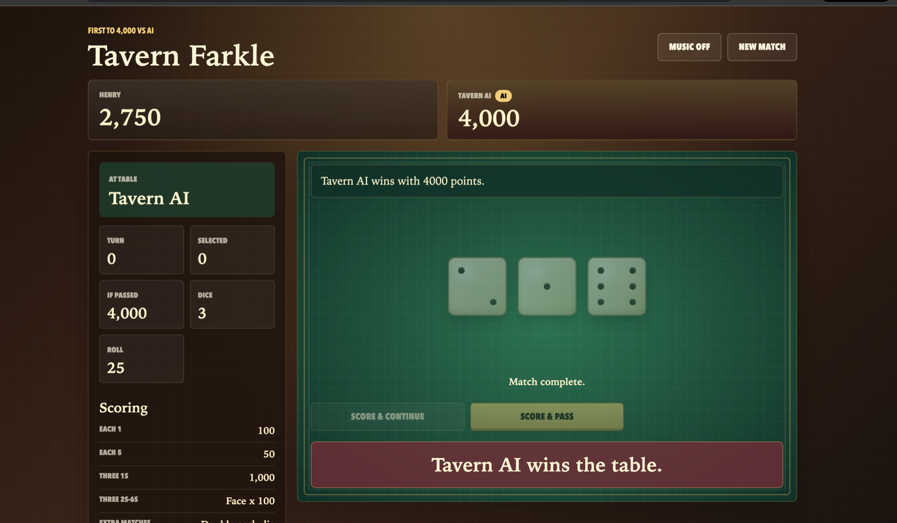

# farkle_dice_game

Dependency-free local Farkle inspired by the core dice table rules in Kingdom Come: Deliverance 2.

## Screenshots







## Play

Open `index.html` in a browser:

```sh
open /Users/chenghao/projects/farkle_dice_game/index.html
```

Choose either two-player hot-seat mode or a local AI opponent on the setup screen. The default target is 4,000 points, with quick and long match presets available.

The AI is rule-based and runs entirely in the browser. It picks the highest-scoring legal dice from the current roll, presses low-value turns, and banks when the turn total is strong or enough to win.

The Music button starts an original browser-generated medieval-style loop with drone, plucked melody, and soft drum accents.

## Rules in This Version

- Six standard dice.
- Single 1s score 100 each.
- Single 5s score 50 each.
- Three 1s score 1,000.
- Three 2s through 6s score face value x 100.
- Four, five, and six of a kind double for each extra matching die past three.
- Straights score as 1-5 = 500, 2-6 = 750, and 1-6 = 1,500.
- Scoring sets must come from the current roll. Sets cannot be built across separate rolls.
- A bust loses only the unbanked points from the current turn.
- If every die from a roll is scored, the player can continue by rolling all six dice again.

Badges, loaded dice, wagers, and online multiplayer are intentionally out of scope for this version.

## Tests

```sh
cd /Users/chenghao/projects/farkle_dice_game
npm test
```
